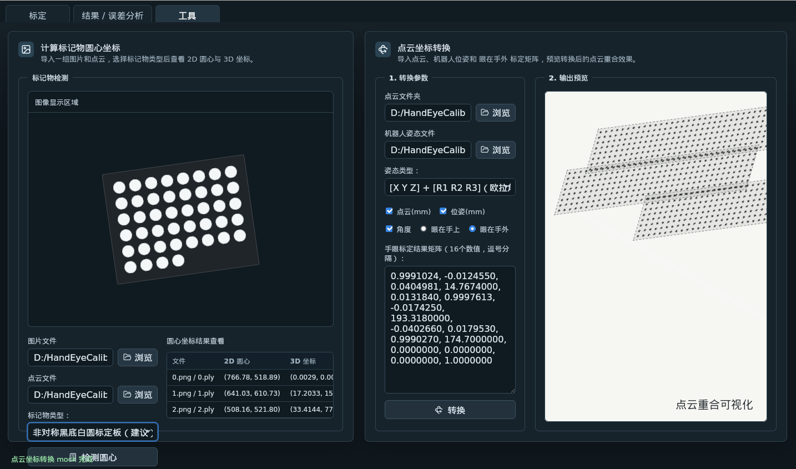

# HandEyeManager UI

**手眼标定管理系统** — 基于 Tauri + React 的桌面应用，提供工业级 ChArUco 标定板手眼标定全流程工具。



## 功能概览

- **标记物检测与标定** — 自动检测 ChArUco 棋盘格角点与 ArUco 标记，支持 RGB/RGB-D 双模式
- **手眼标定计算** — 支持 Eye-in-Hand 与 Eye-to-Hand 两种标定模式，基于重投影误差优化的因子图求解
- **误差分析** — 逐帧 2D 重投影误差、3D 平移/旋转残差、底座一致性 RMS，可剔除异常帧后重新计算
- **3D 坐标预览** — 基于 Three.js 的坐标系可视化，展示相机帧、标定板帧与机器人基座坐标系的空间关系
- **工具集** — ChArUco 检测预览、坐标变换转换输出预览
- **Robot Pose 导入** — 支持多种 Euler 角格式（24 种旋转顺序），适配不同品牌机械臂
- **深度图融合** — 可选 16-bit 深度图参与优化，提升标定精度

## 应用界面

<!-- 请在 docs/images/ 中放置截图后取消注释 -->
<!--  -->
<!--  -->
<!--  -->

应用包含三个主要页面：

| 页面 | 功能 |
|------|------|
| **标定** | 导入 RGB 图像文件夹与机器人位姿文件，配置 ChArUco 标定板参数与相机内参，执行手眼标定计算 |
| **结果 / 误差分析** | 展示标定变换矩阵、逐帧误差表格，支持勾选有效帧后重新计算，导出 YAML 结果 |
| **工具** | 单张图片 ChArUco 检测预览、坐标变换输出 3D 可视化预览 |

## 技术栈

| 层级 | 技术 |
|------|------|
| **桌面框架** | [Tauri v2](https://tauri.app/) (Rust) |
| **前端** | [React 19](https://react.dev/) + [TypeScript](https://www.typescriptlang.org/) |
| **3D 可视化** | [Three.js](https://threejs.org/) |
| **构建工具** | [Vite 7](https://vitejs.dev/) |
| **标定算法** | Python + OpenCV + SciPy + nanomanifold |
| **相机模型** | OpenCV pinhole（支持畸变系数） |
| **标记物检测** | OpenCV ChArUco + ArUco |
| **API 层** | FastAPI + Uvicorn |

## 项目结构

```
calib_software/
├── src/                          # React 前端
│   ├── App.tsx                   # 主应用（标定/结果/工具三页面）
│   ├── CoordinatePreview3D.tsx  # Three.js 3D 坐标系可视化组件
│   ├── TitleBar.tsx              # 自定义标题栏
│   ├── styles.css               # 暗色主题样式
│   ├── mockData.ts               # 示例数据
│   └── assets/                   # 静态资源
│
├── src-tauri/                    # Tauri / Rust 后端
│   ├── src/lib.rs                # 核心命令：标定、检测、文件 I/O、深度图预览
│   ├── Cargo.toml                # Rust 依赖（opencv, nalgebra, apex-solver 等）
│   └── tauri.conf.json           # Tauri 配置
│
├── st_handeye_calibration/       # Python 标定核心库
│   ├── st_handeye/               # 标定核心包
│   │   ├── __init__.py
│   │   ├── calibrator.py         # HandEyeCalibrator 主类
│   │   ├── optimizer.py          # 因子图优化器（SciPy least_squares + nanomanifold）
│   │   ├── board.py              # ChArUco 棋盘格检测
│   │   ├── camera.py             # Pinhole 相机模型
│   │   ├── depth.py              # 深度图加载与采样
│   │   ├── evaluation.py         # 标定评估与可视化
│   │   ├── io.py                 # 位姿 CSV / 相机参数 YAML I/O
│   │   └── types.py              # 数据类型定义
│   ├── calibrate.py              # CLI 入口
│   ├── gui_api.py                # GUI API 层（检测/标定/预览）
│   ├── api_server.py             # FastAPI HTTP 服务
│   └── requirements.txt
│
├── docs/images/                  # README 图片资源
├── package.json
├── vite.config.ts
└── tsconfig.json
```

## 标定算法

采用 **因子图重投影误差最小化** 方法：

1. **角点检测** — 对每张图像检测 ChArUco 角点，通过 PnP 求解标定板到相位的初始变换
2. **初始估计** — 由第一组观测推导全局手眼变换的初始值
3. **联合优化** — 使用 SciPy `least_squares` 在 SE(3) 流形上联合优化：
   - `T_C2F`（Eye-in-Hand）或 `T_C2W`（Eye-to-Hand）：相机到末端/基座变换
   - `T_O2W`（Eye-in-Hand）或 `T_O2F`（Eye-to-Hand）：标定板参考位姿
4. **残差项** — 重投影误差（2D）、深度点误差（3D，可选）、位姿约束（诊断模式）

支持 Robust Kernel（Huber / Soft-L1 / Cauchy）处理异常观测。

## 快速开始

### 前置依赖

- [Node.js](https://nodejs.org/) >= 18
- [Rust](https://rustup.rs/) (通过 rustup 安装)
- [Python](https://www.python.org/) >= 3.9
- OpenCV 4.x 开发包（编译 Rust opencv 绑定需要）

### 安装 Python 依赖

```bash
cd st_handeye_calibration
python3 -m venv .venv
source .venv/bin/activate
pip install -r requirements.txt
```

### 开发模式启动

```bash
# 安装前端依赖
npm install

# 启动 Tauri 开发模式（同时启动 Vite 和 Rust 后端）
npm run tauri dev
```

### 构建生产包

```bash
npm run tauri build
```

### 仅前端开发

```bash
npm run dev
```

## CLI 使用

Python 标定库也支持独立命令行使用：

```bash
cd st_handeye_calibration

# 执行手眼标定
python calibrate.py <图像目录> <位姿文件.csv> \
  -c camera_params.yaml \
  --setup eye-in-hand \
  --visualize \
  --filter_inconsistent

# ChArUco 检测
python gui_api.py detect-charuco <图像路径> \
  --squares_x 14 --squares_y 9 \
  --square_length 0.020 --marker_length 0.015

# 运行标定（CLI 模式）
python gui_api.py run-calibration <图像目录> <位姿文件> \
  --setup eye-in-hand --output result.yaml
```

## 配置说明

### ChArUco 标定板参数

| 参数 | 默认值 | 说明 |
|------|--------|------|
| squares_x | 14 | 横向方格数 |
| squares_y | 9 | 纵向方格数 |
| square_length | 0.020 m | 方格边长 |
| marker_length | 0.015 m | ArUco 标记边长 |
| aruco_dict | DICT_5X5_50 | ArUco 字典类型 |

### 相机参数格式 (camera_params.yaml)

```yaml
camera_matrix:
  - [fx, 0, cx]
  - [0, fy, cy]
  - [0, 0, 1]
distortion_coefficients: [k1, k2, p1, p2, k3]
```

### 机器人位姿格式 (CSV)

每行一个位姿，格式为 `tx, ty, tz, rx, ry, rz`（单位可配置，默认 mm + deg）。

## 许可证

Private — 未经授权禁止使用。
